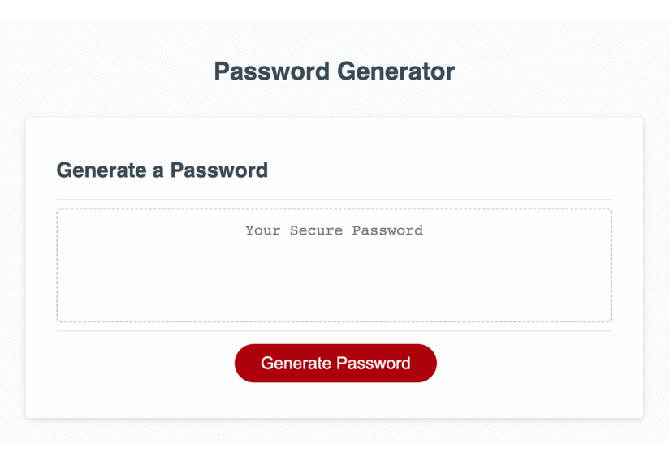
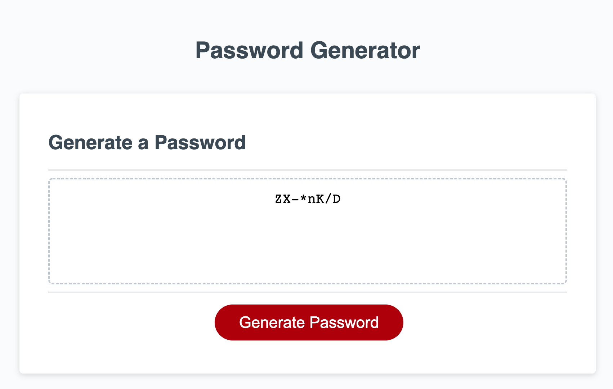

# Random Password Generator

This website will generate a random password when the "Generate Password button is clicked.

Layout and content were built using HTML, CSS & JavaScript using VS Code.

## Random Password Generator Website

## Website Function:

* When the "Generate Password" button is clicked you are presented with a series of prompts.
    * Length of password.
    * Has to be between 8 and 128 characters.
    * Whether or not to include lowercase, uppercase, numeric, and/or special characters.
    * At the minimum, one character should be selected.
    * When all prompts are answered then a password is generated that matches the criteria.
    * Password will be displayed to the page.

## GitHub repository for challenge 3
* [Github Repo](https://github.com/joliver521/friendly-parakeet)

## Live website for challenge 3
* [Live Password Generator Website](https://joliver521.github.io/friendly-parakeet/)

